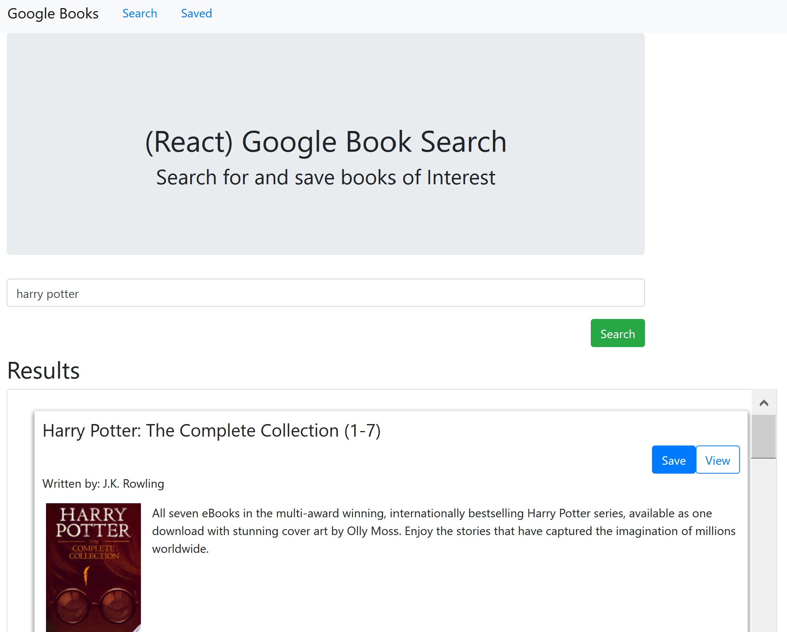

# book-search
A React-based Google Books Search app.

## User Story

The requirement was to create a React app that allows a user to search for books by title using the Google Books API. The user can then view further details about the books and save them to a Mongo DB for later retrieval.

## Built With

- [VScode](https://code.visualstudio.com/) - The editor of choice

#### Initial interface

### Licence

MIT

### Link to app on heroku

<a href="https://fierce-wave-06215.herokuapp.com/">Book Search</a>

### Link to the github Repo

<a href="https://https://github.com/galluk/book-search">book-search</a>

## Author

- **Luke Gallagher** -
  luke.gallagher.cst@gmail.com